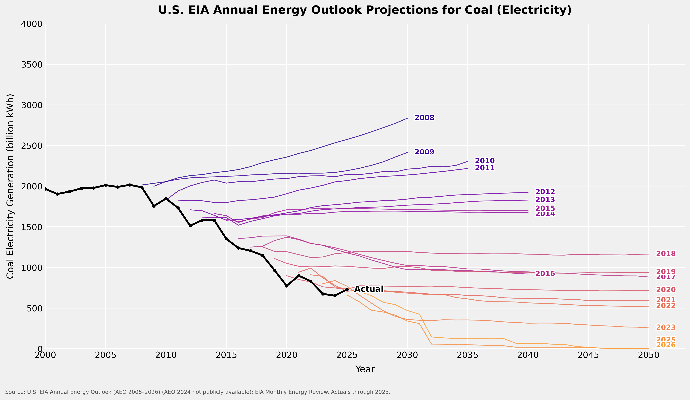

# EIA Annual Energy Outlook Projections

Compares actual energy data against EIA Annual Energy Outlook (AEO) predictions made each year. Each chart overlays one thin colored line per AEO vintage (reference case) against a thick black line of actual historical data, illustrating how EIA's forecasts have evolved over time.

An example of the plots we create:  


---

## Scripts

### `prediction_chart.py` — Electricity Generation

Generates spaghetti-plot charts of AEO electricity generation projections (billion kWh) vs. actuals for coal, natural gas, solar, wind, and nuclear.

A free EIA API key is required. Get one at https://www.eia.gov/opendata/ and set it before running:
```bash
export EIA_API_KEY=your_key_here
python prediction_chart.py
```

Output PNGs (300 DPI) are written to `output/generation/`:
- `coal_projections.png`
- `gas_projections.png`
- `solar_projections.png`
- `wind_projections.png`
- `nuclear_projections.png`
- `coal_gas_projections.png` (combined)
- `solar_wind_projections.png` (combined)

---

### `price_chart.py` — Thermal Fuel Prices

Generates spaghetti-plot charts of AEO thermal fuel price projections vs. actual historical prices for four fuels delivered to the electric power sector.

```bash
export EIA_API_KEY=your_key_here
python price_chart.py
```

Output PNGs (300 DPI) are written to `output/prices/`:
- `gas_price_projections.png` — natural gas to electric power (real $/Mcf)
- `coal_price_projections.png` — steam coal to electric power (real $/MMBtu)
- `crude_oil_price_projections.png` — crude oil import price (real $/barrel)
- `nuclear_fuel_price_projections.png` — nuclear fuel to electric power ($/MMBtu)

---

### `price_chart2.py` — LCOE History (Lazard + NREL ATB)

Generates LCOE history charts for all major generation technologies using Lazard's annual LCOE Analysis (v1.0–v18.0, 2008–2025). For four technologies (solar PV, onshore wind, nuclear, offshore wind), NREL Annual Technology Baseline (2019–2024) projection lines are overlaid.

No API key required.

```bash
python price_chart2.py
```

Output PNGs (300 DPI) are written to `output/prices2/`:
- `solar_pv_lcoe_lazard.png`
- `onshore_wind_lcoe_lazard.png`
- `offshore_wind_lcoe_lazard.png`
- `nuclear_lcoe_lazard.png`
- `gas_cc_lcoe_lazard.png`
- `coal_lcoe_lazard.png`
- `gas_peaker_lcoe_lazard.png`
- `all_technologies_lcoe_lazard.png` (combined midpoints)

---

## Data Sources

### AEO Vintage Projections (generation & prices)

All generation and price charts draw vintage projections from the same tiered sources.

**Primary — EIA AEO Retrospective CSV**
```
https://www.eia.gov/outlooks/aeo/retrospective/csv/dashappdata_allcases.csv
```
A single CSV maintained by EIA containing reference-case projections from every AEO edition alongside actual historical values. Covers AEO vintages from roughly 2005 onward.

**Fallback — EIA API v2**
```
https://api.eia.gov/v2/aeo/{vintage_year}/data/
```
Used for vintages missing from the retrospective CSV. Requires `EIA_API_KEY`.

**Tertiary fallback — EIA bulk ZIP files**
```
https://www.eia.gov/opendata/bulk/AEO{year}.zip
```
Newline-delimited JSON bundles; no API key required. Nuclear fuel price projections use this source primarily, as the retrospective CSV does not include nuclear fuel price series.

### LCOE Sources (`price_chart2.py`)

**Lazard LCOE Analysis** (v1.0–v17.0 via DataHub; v18.0 hard-coded)
```
https://datahub.io/climate-and-environment/lazard-levelized-cost-of-energy/_r/-/data/lcoe.csv
```
Annual unsubsidized LCOE low/high ranges for 7 technologies, 2008–2025. Note: v1–v5 (2008–2011) reported subsidized LCOE; v6+ (2012 onward) unsubsidized.

**NREL Annual Technology Baseline (ATB)**
```
https://oedi-data-lake.s3.amazonaws.com/ATB/electricity/csv/{year}/ATBe.csv
```
Multi-year LCOE projections from 6 ATB vintages (2019–2024), Moderate scenario, 30-year cost recovery period, no tax credit, R&D case. Overlaid on four Lazard charts where ATB technology coverage aligns.

---

## Caveats

**AEO 2024 is unavailable.** EIA's API, retrospective CSV, and bulk ZIP archive all skip from 2023 to 2025. All generation and price charts cover AEO 2008–2023 and 2025–2026, with 2024 explicitly absent.

**AEO 2026 uses a different scenario name.** EIA restructured AEO 2026 around a "Current Baseline" scenario labeled `CB2026` rather than the traditional `REF2026`. The scripts detect this automatically.

**Nuclear fuel price actuals are unavailable.** EIA's machine-readable APIs do not return national-level nuclear fuel cost data; the nuclear fuel price chart shows projections only.

**Nuclear fuel price projections available only from AEO 2017 onward.** Bulk ZIP files for AEO 2008–2013 return 404; AEO 2014–2016 ZIPs do not contain the nuclear fuel price series.

**Each vintage projection line starts at its publication year.** Historical data included in each AEO publication is excluded from the projection lines; only forward-looking values are plotted.

**IRA inflection in recent AEO editions.** The Inflation Reduction Act (2022) clean energy incentives are more fully incorporated in AEO 2023 and later, driving sharp revisions in renewable and fossil fuel projections.
