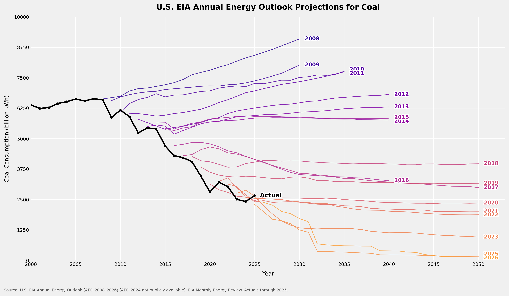

# EIA Annual Energy Outlook Projections – Electricity by Fuel

Compares actual electricity generation against EIA Annual Energy Outlook (AEO) predictions made each year. Each chart overlays one thin colored line per AEO vintage (reference case) against a thick black line of actual historical data, illustrating how EIA's forecasts have evolved over time. All charts share the same y-axis unit (billion kWh).

An example of the plots we create:  


---

## Scripts

**`prediction_chart.py`** — fetches data, processes it, and writes all six projection charts.

A free EIA API key is required. Get one at https://www.eia.gov/opendata/ and set it before running:
```bash
export EIA_API_KEY=your_key_here
python prediction_chart.py
```

Output PNGs (300 DPI) are written to `output/`:
- `output/coal_projections.png`
- `output/wind_projections.png`
- `output/solar_projections.png`
- `output/nuclear_projections.png`
- `output/gas_projections.png`
- `output/coal_gas_projections.png`

Downloaded data is cached in `cache/` and reused on subsequent runs. To force a re-download, delete the relevant file from `cache/`.

The script is parameterized by an `ENERGY_TYPES` dict near the top of the file. Adding a new energy series requires only a new entry in that dict with the appropriate EIA column name and API series ID.

---

**`coal_slope.py`** — reads the cached retrospective CSV (no API key needed after `prediction_chart.py` has run once) and plots the **near-term slope** of each AEO vintage's coal projection vs. the vintage year. The slope is the linear-regression coefficient (billion kWh/year) fitted over the first 10 projected years of each vintage's reference case.

```bash
python coal_slope.py
```

Output: `output/coal_slope.png`

The chart shows that early AEO editions (2008–2015) expected coal generation to keep rising, the outlook flipped to negative around 2015–2016 (coinciding with the Paris Agreement and accelerating U.S. coal retirements), and recent editions project increasingly steep declines.

---

## Data Sources

### AEO Vintage Projections

All energy types draw vintage projections from the same primary source, with fallbacks for any missing vintages.

**Primary — EIA AEO Retrospective CSV**
```
https://www.eia.gov/outlooks/aeo/retrospective/csv/dashappdata_allcases.csv
```
A single CSV maintained by EIA that contains reference-case projections from every AEO edition alongside actual historical values. It covers AEO vintages from roughly 2005 onward. One download provides projections for all energy types across most vintages.

Relevant columns:
| Column | Description |
|--------|-------------|
| `GEN_NA_ELEP_TGE_CL_NA_USA_BLNKWH` | Coal electricity generation, electric power sector (billion kWh) |
| `GEN_NA_ALLS_NA_WND_NA_NA_BLNKWH` | Wind electricity generation, all sectors (billion kWh) |
| `GEN_NA_ALLS_NA_SLR_NA_NA_BLNKWH` | Solar electricity generation, all sectors (billion kWh) |
| `GEN_NA_ELEP_TGE_NUP_NA_USA_BLNKWH` | Nuclear electricity generation, electric power sector (billion kWh) |
| `GEN_NA_ELEP_TGE_NG_NA_USA_BLNKWH` | Natural gas electricity generation, electric power sector (billion kWh) |

**Fallback — EIA API v2**
```
https://api.eia.gov/v2/aeo/{vintage_year}/data/
```
Used for any vintage missing from the retrospective CSV. Scenario facet is `ref{year}` for most vintages; AEO 2026 uses `cb2026` ("Current Baseline 2026"). Requires `EIA_API_KEY`.

**Tertiary fallback — EIA bulk ZIP files**
```
https://www.eia.gov/opendata/bulk/AEO{year}.zip
```
Newline-delimited JSON bundles available for most vintages. No API key required.

### Historical Actuals

All actuals are sourced from the retrospective CSV's `ACTUAL` rows as the primary source, supplemented by EIA API calls for years more recent than the CSV covers.

**Coal, Nuclear, Natural Gas** — retrospective CSV actuals, extended to the latest available year via the EIA electricity generation API (`/v2/electricity/electric-power-operational-data/`), fuel type codes `COL`, `NUC`, and `NG` respectively.

**Wind** — retrospective CSV actuals (effectively all-sector, since distributed wind is negligible), extended via the EIA MER API (MSN `WYETPUS`, "Electricity Net Generation From Wind, All Sectors").

**Solar** — the retrospective CSV `ACTUAL` rows cover only the electric power sector (utility-scale), but the AEO projection lines are all-sector (utility + distributed). Solar actuals are therefore fetched from the EIA MER API as the primary source, summing utility-scale (`SOT5PUS`) and small-scale distributed (`SOT7PUS`) generation. Early years where the MER API lacks data are backfilled with the retro CSV (pre-2014 distributed solar was negligible).

For manual cross-checking, AEO supplement tables are published at:
```
https://www.eia.gov/outlooks/aeo/tables_ref.php
```

---

## Metrics

All charts use **billion kWh** on the y-axis and cover **AEO vintages 2008–2026** (2024 absent; see Caveats). No unit conversion is required — all EIA series are already in billion kWh.

| Chart | Metric | Sector |
|-------|--------|--------|
| Coal | Electricity generation from coal | Electric power sector |
| Wind | Electricity generation from wind | All sectors |
| Solar | Electricity generation from solar (utility + distributed) | All sectors |
| Nuclear | Electricity generation from nuclear | Electric power sector |
| Natural Gas | Electricity generation from natural gas | Electric power sector |
| Coal + Natural Gas | Sum of coal and natural gas electricity generation | Electric power sector |

Wind and solar use "all sectors" because AEO projections for those fuels include distributed/behind-the-meter generation. Coal, natural gas, and nuclear are reported on an electric power sector basis, consistent with the AEO projection series (`GEN_NA_ELEP_TGE_*`).

---

## Caveats

**AEO 2024 is unavailable.** EIA's API v2, retrospective CSV, and bulk file archive all skip from 2023 to 2025. No data for AEO 2024 was found through any EIA channel, consistent with reports of reduced EIA output capacity that year. All charts cover AEO 2008–2023 and 2025–2026, with 2024 explicitly absent.

**AEO 2026 uses a different scenario name.** EIA restructured AEO 2026 around a "Current Baseline" scenario labeled `CB2026` rather than the traditional `REF2026`. The script detects this automatically. The prior-year reference (`AEO2025REF`), bundled inside the 2026 data for comparison, is excluded.

**AEO 2020** was a preliminary release delayed by COVID-19 and may show a minor discontinuity relative to adjacent vintages.

**IRA inflection in recent AEO editions.** The Inflation Reduction Act (2022) clean energy incentives are more fully incorporated in AEO 2023 and later, which accounts for the sharp downward revision in coal projections and correspondingly larger upward revisions in wind and solar projections.

**Each vintage line starts at its publication year.** Historical data included in each AEO publication is excluded from the projection lines; only forward-looking values are plotted.
